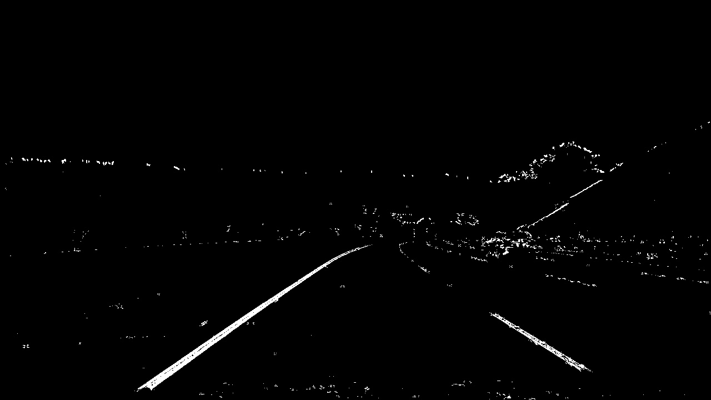
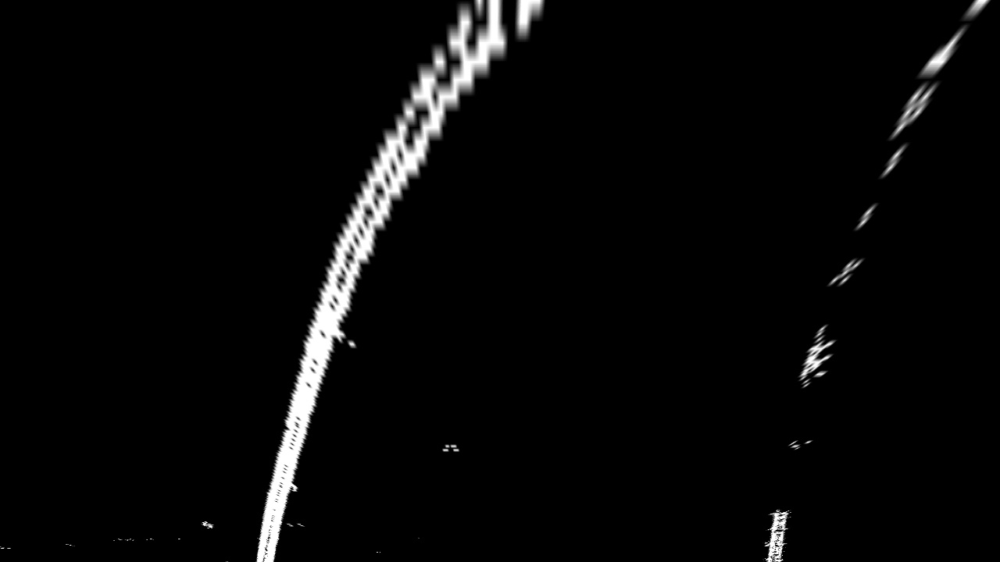
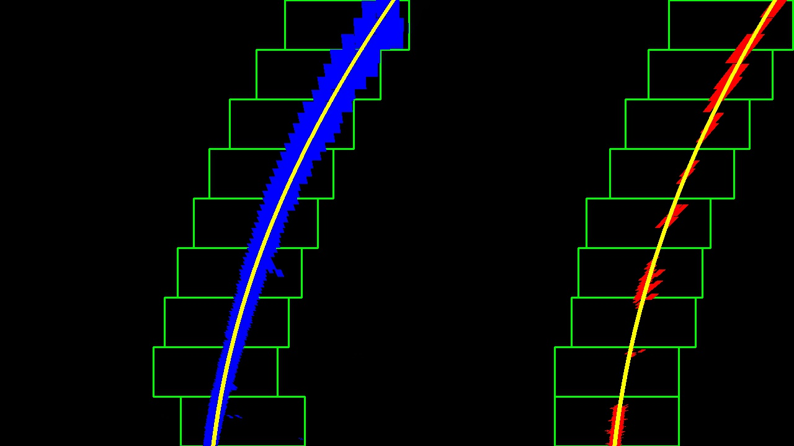
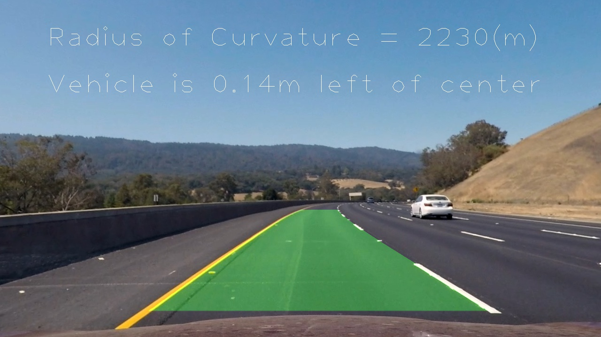

#**Advanced Lane Finding Project**

The goals / steps of this project are the following:

* Compute the camera calibration matrix and distortion coefficients given a set of chessboard images.
* Apply a distortion correction to raw images.
* Use color transforms, gradients, etc., to create a thresholded binary image.
* Apply a perspective transform to rectify binary image ("birds-eye view").
* Detect lane pixels and fit to find the lane boundary.
* Determine the curvature of the lane and vehicle position with respect to center.
* Warp the detected lane boundaries back onto the original image.
* Output visual display of the lane boundaries and numerical estimation of lane curvature and vehicle position.


## [Rubric](https://review.udacity.com/#!/rubrics/571/view) Points

### Here I will consider the rubric points individually and describe how I addressed each point in my implementation.  

---

### Camera Calibration

#### 1. Briefly state how you computed the camera matrix and distortion coefficients. Provide an example of a distortion corrected calibration image.

The code for this step is contained in the first code cell of the IPython notebook located in "./calc_dist_coef.ipynb" .  

I start by preparing "object points", which will be the (x, y, z) coordinates of the chessboard corners in the world. Here I am assuming the chessboard is fixed on the (x, y) plane at z=0, such that the object points are the same for each calibration image.  Thus, `objp` is just a replicated array of coordinates, and `objpoints` will be appended with a copy of it every time I successfully detect all chessboard corners in a test image.  `imgpoints` will be appended with the (x, y) pixel position of each of the corners in the image plane with each successful chessboard detection.  

I then used the output `objpoints` and `imgpoints` to compute the camera calibration and distortion coefficients using the `cv2.calibrateCamera()` function.  I applied this distortion correction to the test image using the `cv2.undistort()` function and obtained this result: 


### Pipeline (single images)

#### 1. Provide an example of a distortion-corrected image.

To demonstrate this step, I will describe how I apply the distortion correction to one of the test images like this one:


#### 2. Describe how (and identify where in your code) you used color transforms, gradients or other methods to create a thresholded binary image.  Provide an example of a binary image result.

I used a combination of color and gradient thresholds to generate a binary image (thresholding steps at 4) to 5) of 'Main process to find lane' in `test.ipynb`).  Here's an example of my output for this step.  



#### 3. Describe how (and identify where in your code) you performed a perspective transform and provide an example of a transformed image.

##### 3-1. (Preprocessing) In order to find the coordinates of the rectangle of the road area, I created a program to display the coordinates of the clicked points (get_cordinate.py).

##### 3-2. (Preprocessing) Use the obtained source coordinates(`src`) and destination (`dst`) points, and Get the transform matrix ("./calc_dist_coef.ipynb").

##### 3-3. Use cv2.warpPerspective() to warp binary image to a top-down view. (at 6) of 'Main process to find lane' in `test.ipynb`)

```python
src = np.float32(
    [[599, 448],
    [682, 448],
    [1017, 665],
    [288, 665]])
dst = np.float32(
    [[img_size[0]/4,0],
    [img_size[0]*3/4,0],
    [img_size[0]*3/4,img_size[1]],
    [img_size[0]/4,img_size[1]]])
```

This resulted in the following source and destination points:

| Source        | Destination   | 
|:-------------:|:-------------:| 
| 599, 448      | 320, 0        | 
| 682, 448      | 960, 0        |
| 1017, 665     | 960, 720      |
| 288, 665      | 320, 720      |




#### 4. Describe how (and identify where in your code) you identified lane-line pixels and fit their positions with a polynomial?

Get histogram of warped image.
Split the histogram for the two lines.
Set up windows and window hyperparameters.
Loop for nwindows, with the given window sliding left or right if it finds the mean position of activated pixels within the window to have shifted.
(at 7) of 'Main process to find lane' in `test.ipynb`)



#### 5. Describe how (and identify where in your code) you calculated the radius of curvature of the lane and the position of the vehicle with respect to center.

Fit a second order polynomial to each using `np.polyfit`
(at 8) of 'Main process to find lane' in `test.ipynb`)

Calculates the curvature of polynomial functions in meters
(at 9) of 'Main process to find lane' in `test.ipynb`)

Calculate the vehicle position
(at 10) of 'Main process to find lane' in `test.ipynb`)

#### 6. Provide an example image of your result plotted back down onto the road such that the lane area is identified clearly.

Project detected lines onto the original image.
(at 11) of 'Main process to find lane' in `test.ipynb`)

Display the calculation result of the curvature
(at 12) of 'Main process to find lane' in `test.ipynb`)

Display the calculation result of the vehicle position
(at 13) of 'Main process to find lane' in `test.ipynb`)



---

### Pipeline (video)

#### 1. Provide a link to your final video output.  Your pipeline should perform reasonably well on the entire project video (wobbly lines are ok but no catastrophic failures that would cause the car to drive off the road!).

Here's a [link to my video result](./radius_of_curvature.mp4)
('curve_detect.ipynb')

---

### Discussion

#### 1. Briefly discuss any problems / issues you faced in your implementation of this project.  Where will your pipeline likely fail?  What could you do to make it more robust?

In order to reduce the influence of noise, it is necessary to reduce the width of window, but it can not deal with a steep curve.

A line can not be found if most of the image is white out.

When losing sight of the line, estimate the location of the line by using past observation result and the amount of movement of the car.
