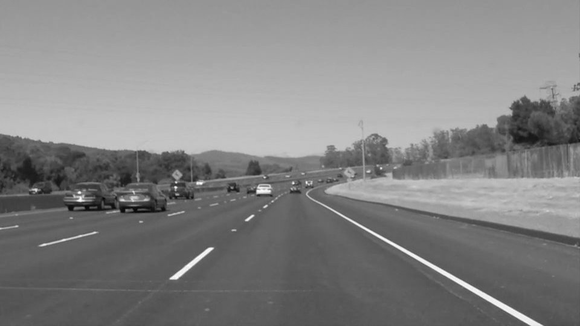
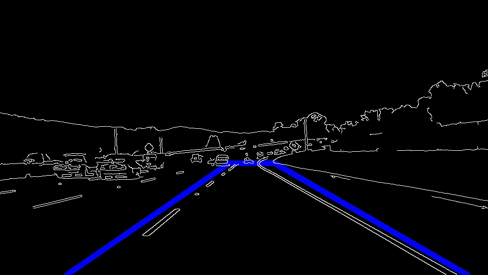
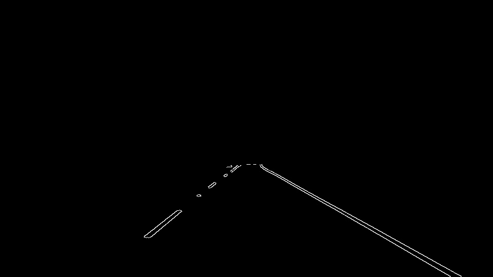

# **Finding Lane Lines on the Road** 

## Reflection

Original Image

### 1. Describe your pipeline. As part of the description, explain how you modified the draw_lines() function.

#### 1st Step. Convert the Image to grayscale 

#### 2nd Step. Apply Gaussian smoothing to the Grayscale Image

Kernel Size : 5

#### 3rd Step. Apply Canny edge detection to the Blur Image

Low threshold = 50, High threshold = 150

#### 4th Step. Mask the pixels out of the four sided polygon that I define on the Image

---

 My pipeline consisted of 5 steps. First, I converted the images to grayscale, then I .... 

In order to draw a single line on the left and right lanes, I modified the draw_lines() function by ...

If you'd like to include images to show how the pipeline works, here is how to include an image: 

### 2. Identify potential shortcomings with your current pipeline

One potential shortcoming would be what would happen when ... 

Another shortcoming could be ...

### 3. Suggest possible improvements to your pipeline

A possible improvement would be to ...

Another potential improvement could be to ...
