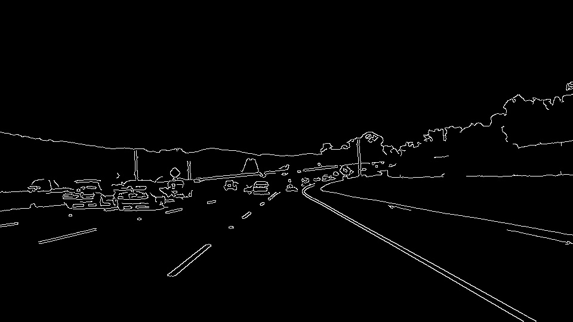

# **Finding Lane Lines on the Road** 

## Reflection

Original Image

### 1. Describe your pipeline. As part of the description, explain how you modified the draw_lines() function.

#### Step 1. grayscale() : Convert the Image to grayscale 

#### Step 2. gaussian_blur() : Apply Gaussian smoothing to the Grayscale Image

kernel size : 5

#### Step 3. canny() : Apply Canny edge detection to the Blur Image

low threshold : 50, high threshold : 150

#### Step 4. region_of_interest() : Mask the pixels out of the four sided polygon that I defined on the Image

#### Step 5. hough_lines() : Get lines by Applying Hough line transform to the Masked Image

rho : 1, theta : Pi/180, threshold : 5, min_line_len : 15, max_line_gap : 5

#### Step 6. draw_lines() : Classify lines as right and left by Slope and Position 

Lines close to horizontal are not classified in either direction to remove noises. 

#### Step 7. draw_lines() : Calculate the weighted average of the slopes and intercepts of the classified lines

Weight by line length to remove noises. 

#### Step 8. draw_lines() : Calculate the x coordinate of the specified y coordinate from the slope and intercept

#### Step 9. weighted_img() : Overlap Original image and Line image

### 2. Identify potential shortcomings with your current pipeline

(1) Since the masked area was optimized for this project, it is not effective on other roads.

(2)　When the road lines are dots, it is impossible to obtain a correct slope.

(3) For example, if there is a shadow on the road or the colors of the road and the lines are similar, it is not possible to extract the edge.

### 3. Suggest possible improvements to your pipeline

(1) Flatten the histogram of the image to reduce the effect of brightness.

(2) Exclude lines that are largely out of the previous judgment result.

